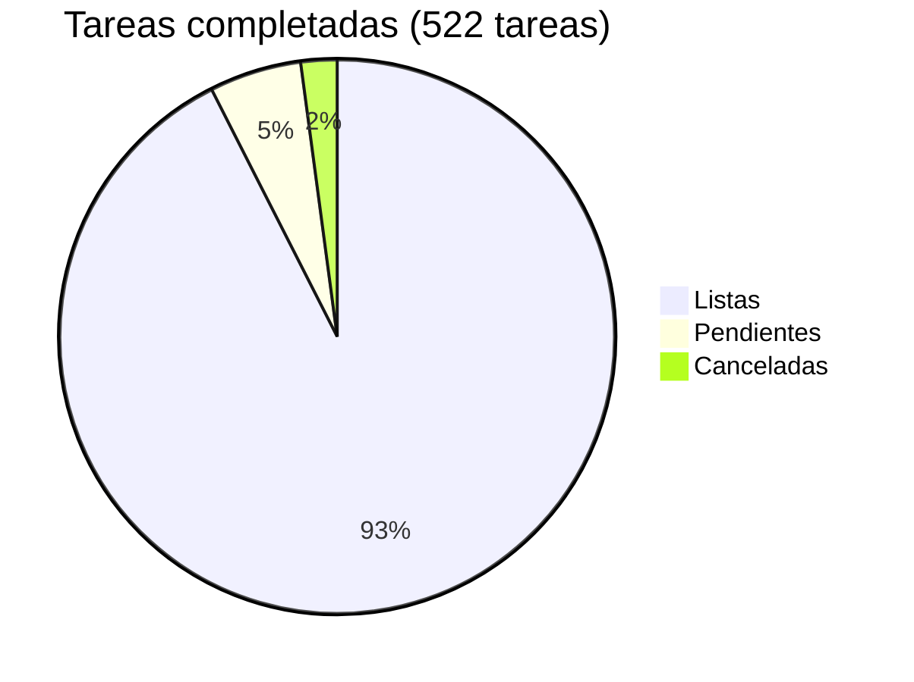

# Acopio — Roadmap

## Progreso general



| Fase | Nombre | Listas | Pendientes | Canceladas | Progreso |
|------|--------|-------:|-----------:|-----------:|----------|
| 0 | [Scaffolding + multi-tenant + roles](phase-00-scaffolding.md) | 18 | 0 | 0 | ✅ 100% |
| 1 | [Catálogo e intake con validaciones](phase-01-catalog-intake.md) | 8 | 0 | 0 | ✅ 100% |
| 2 | [Caja homogénea, QR y etiqueta](phase-02-box-qr-label.md) | 6 | 0 | 0 | ✅ 100% |
| 3 | [Tarima, envío y manifiesto](phase-03-pallet-shipment-manifest.md) | 9 | 0 | 0 | ✅ 100% |
| 4 | [Panel agregado nacional + endurecimiento + OTP + scanning móvil](phase-04-national-dashboard-hardening.md) | 23 | 2 | 0 | ✅ 92% |
| 5 | [Studio — panel de administración + solicitudes](phase-05-studio.md) | 39 | 0 | 0 | ✅ 100% |
| 6 | [Catálogos de referencia + lookups en tiempo real](phase-06-catalog-integrations.md) | 37 | 0 | 0 | ✅ 100% |
| 7 | [Transferencias entre centros](phase-07-transfers.md) | 21 | 0 | 0 | ✅ 100% |
| 8 | [Mensajería entre usuarios](phase-08-messaging.md) | 22 | 0 | 0 | ✅ 100% |
| 9 | [Reportes de campaña](phase-09-reports.md) | 8 | 0 | 0 | ✅ 100% |
| 10 | [Endurecimiento de seguridad (post-auditoría)](phase-10-security-hardening.md) | 22 | 0 | 0 | ✅ 100% |
| 11 | [SEO y reposicionamiento genérico](phase-11-seo-positioning.md) | 26 | 0 | 0 | ✅ 100% |
| 12 | [Optimización y rendimiento](phase-12-optimization.md) | 29 | 0 | 0 | ✅ 100% |
| 13 | [Compliance y legal](phase-13-compliance-legal.md) | 10 | 0 | 10 | ✅ 100% |
| 14 | [Auto-registro de centros con aprobación](phase-14-center-self-registration.md) | 17 | 0 | 0 | ✅ 100% |
| 15 | [Deliverability de emails + aviso de solicitudes](phase-15-email-deliverability.md) | 15 | 0 | 0 | ✅ 100% |
| 16 | [Rediseño de plantillas de email con marca](phase-16-email-brand-redesign.md) | 10 | 0 | 0 | ✅ 100% |
| 17 | [AEO/GEO + expansión de keywords](phase-17-aeo-keyword-expansion.md) | 21 | 7 | 0 | 🟡 75% |
| 18 | [Pre-registro de donaciones por el donante](phase-18-donor-preregistration.md) | 23 | 0 | 0 | ✅ 100% |
| 19 | [Identidad estructurada del donante en el intake](phase-19-structured-donor-identity.md) | 9 | 0 | 0 | ✅ 100% |
| 20 | [Prevención de riesgos: responsabilidad y anti-lavado en especie](phase-20-risk-prevention.md) | 6 | 4 | 0 | 🟡 60% |
| 21 | [Logística: pesaje, declaración de mercancías y perfiles de paletizado](phase-21-logistics-weighing.md) | 12 | 0 | 0 | ✅ 100% |
| 22 | [Trazabilidad extendida: avión y destino](phase-22-extended-traceability.md) | 14 | 0 | 0 | ✅ 100% |
| 23 | [IA asistida: captura, catálogo y necesidades](phase-23-ai-assisted-capture.md) | 11 | 0 | 0 | ✅ 100% |
| 24 | [Observabilidad: que un fallo silencioso deje de serlo](phase-24-observability.md) | 11 | 0 | 0 | ✅ 100% |
| 25 | [Captura sin conexión: cola local y sincronización diferida](phase-25-offline-capture.md) | 14 | 0 | 0 | ✅ 100% |
| 26 | [Soporte de backend para el cliente nativo](phase-26-native-client-support.md) | 20 | 0 | 0 | ✅ 100% |
| 27 | [De quién es el día: zona horaria del centro](phase-27-center-timezone.md) | 0 | 6 | 0 | ⬜ 0% |
| 28 | [Otro nombre para el mismo producto](phase-28-product-aliases.md) | 6 | 2 | 0 | 🟡 75% |
| 29 | [De `araguaney.lat` a `araguaney.org`](phase-29-domain-migration.md) | 16 | 8 | 1 | 🟡 67% |
| 30 | [Aprovechar Project Galileo](phase-30-galileo-hardening.md) | 5 | 1 | 0 | 🟡 83% |
| **Total** | | **488** | **30** | **11** | **🟡 92%** |

> **Canceladas (11):** la tarea 16 de la Fase 29 (mover el webhook de Resend) no aplica mientras el webhook siga apagado a propósito; el hueco queda en `docs/observability.md`. Las otras diez: el bloque de donativos/pagos de la Fase 13 (Grupo B: entidad receptora,
> asesoría legal/contable, procesador de pagos, T&C de donación, transparencia) se canceló el
> 2026-09-03. Contradice el no-objetivo declarado en `CLAUDE.md` §2 ("No gestiona dinero ni
> donativos económicos") y no hay decisión de negocio de habilitarlo. El diseño queda documentado
> en [`phase-13-compliance-legal.md`](phase-13-compliance-legal.md) por si se retoma algún día,
> pero deja de contar como progreso pendiente. El Grupo A de esa misma fase (privacidad, lo que
> aplica hoy) está completo.

> **Pendientes (11):**
> - **Fase 26 (soporte al cliente nativo) está completa: 0 pendientes.** El bloque de
>   contrato, el de avisos push y las seis tareas que pedía el cliente móvil (report por
>   estado, identidad en refresh, códigos de error con nombre, nombres de centro en
>   transferencias, detalle de intake y cuerpo tipado en `add-box`) quedaron cerrados. El
>   despacho de push está **prendido en producción** (`PUSH_ENABLED=true`) y verificado de
>   punta a punta el 2026-09-03 con un envío real a un dispositivo. Hoy avisa de tres hechos:
>   una revisión de riesgo abierta, un envío entregado y un mensaje privado recibido. Los dos
>   primeros van a la coordinación del centro. El de mensajes solo cubre
>   hilos privados y no repite mientras quien recibe no haya abierto el anterior: los hilos
>   de campaña son difusión y el correo, que no interrumpe, ya los cubre.
> - Los borradores legales de la Fase 20 están escritos y esperando revisión de abogado:
>   [`docs/legal/drafts/`](../legal/drafts/README.md). Sus tareas siguen abiertas hasta que esa
>   revisión ocurra. El borrador fiscal de la Fase 21 quedó sin uso: la declaración de mercancías
>   dejó de ser específica de un país, así que ya no hay orientación tributaria que revisar.
> - **4 de la Fase 20 (prevención de riesgos):** los controles de producto están puestos (aceptación
>   registrada, umbral con escalamiento, leyenda de aduana, guía de banderas rojas y controles
>   estructurales documentados). Lo que queda son los tres textos legales (tasks 1, 2 y 6), que la
>   task 7 —revisión de abogado— gatea antes de publicar; los borradores ya están escritos en
>   [`docs/legal/drafts/`](../legal/drafts/README.md).
> - **Fase 23 (IA asistida) está completa en código, no en producción.** Las cuatro capacidades,
>   la evaluación, el aviso de privacidad y el panel de gasto ya están, todo apagado por defecto.
>   Encender cualquier capacidad exige antes completar su conjunto de referencia con capturas
>   reales y superar su umbral: el código está listo, la medición no. Diseño en
>   [su spec](../superpowers/specs/2026-07-29-ai-assisted-capture-design.md).
> - **2 gated por pago (Fase 4):** spend caps + alertas, requieren plan de pago de infra.
> - **7 ejecutables (Fase 17):** tasks 25 (portugués y región destino) y 28 (inventario para bancos de alimentos) esperan datos de Search Console de `araguaney.org`; tasks 6 (Wikidata) y 8 (directorios) preparadas en
>   [`docs/seo/entity-registration.md`](../seo/entity-registration.md); 17 (video demo, requiere
>   grabar el video). Las de medición (19 monitoreo de citas en IA, 20 analítica de Bing) quedan
>   **preparadas** con el instrumento de [`docs/seo/aeo-monitoring.md`](../seo/aeo-monitoring.md)
>   (banco de prompts, plantillas y KPIs); correrlas cada mes es mantenimiento. La task 21 (definir
>   KPIs) quedó **cerrada** con ese mismo instrumento.

> Envs opcionales (Sentry, Slack, Google Safe Browsing, Encryption Key) se pueden agregar en cualquier momento sin cambios de código.

---

## Dependencias entre fases

```
Fase 0 ─► Fase 1 ─► Fase 2 ─► Fase 3 ─► Fase 4
                └──────────────► (panel agregado usa datos de 1–3)
                                              │
                                              └──► Fase 5 (Studio)
```

- Fase 4 (endurecimiento + scanning móvil) puede solaparse con 2–3 según prioridad mediática.
- Fase 5 (Studio) depende de Fase 0 (usuarios/roles) pero es independiente de 1–4; puede arrancarse en paralelo.
- Fase 7 (Transferencias) depende de Fases 1–3 (Box/Pallet/Shipment ya deben existir) y de Fase 6 (campaign_id en intakes, scoping de ProductType).
- Fase 8 (Mensajería) depende de Fase 6 (user_campaigns ya debe existir para validar el scope de campaña).

---

## Notas de edición

> **Este repositorio es público.** El roadmap y los specs se leen desde fuera,
> así que al escribirlos: nada de credenciales, correos de operación, hosts de
> infraestructura ni datos de cuentas de prueba. Y en controles de seguridad o
> antifraude, publica el **mecanismo** pero no el **parámetro** que determina
> cuándo se activa (umbrales, límites, ventanas): esos viven en variables de
> entorno. Documentar un hueco conocido está bien; escribir el paso a paso para
> aprovecharlo, no.

Cada fase vive en su propio archivo bajo `docs/roadmap/`. Al editar:

- Actualiza el archivo de fase con el cambio de tarea (✅ Done / 🟡 In progress / ⬜ Pendiente /
  🚫 Cancelada — se decidió no hacerla, se documenta el porqué y deja de contar como pendiente).
- Actualiza los totales, el pie chart y la columna Canceladas en este índice al completar,
  cancelar o agregar tareas.
- Nuevas fases: archivo `phase-NN-<slug>.md` + fila en la tabla de arriba.
